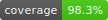

<p align="center">
  
</p>

#  Nostragoalus

 

A football score-prediction game: friends predict match scores and earn points by how close they
get, ranked per competition and on a global leaderboard. Ships with the **FIFA World Cup 2026**
(default), **World Cup 2022**, and **UEFA Euro 2024**.

Source: <https://git.arzaroth.com/Arzaroth/Nostragoalus>

## Runtimes

Built and tested on **Node.js 22** and **Bun**:

```sh
pnpm build && node .output/server/index.mjs   # or: bun .output/server/index.mjs
```

## Features

- Score predictions with closeness-tiered points, a rarity bonus, and one ×2 **joker** per round;
  Enter/space hops between score inputs so a whole matchday can be typed without the mouse, a banner
  counts how many matches still need a pick before the next lockout (with a jump to the soonest), and
  a wildly high scoreline asks you to confirm before it saves
- Optional **crowd totals** under every prediction (everyone's picks combined), updated live over WebSocket
- **Bookmaker odds** (decimal 1X2, Sofascore feed) under every score input, frozen at kickoff;
  optional ODDS scoring mode awards the bonus from the closing odds of the actual outcome, and an
  admin backfill recovers closing odds for past tournaments. Admins pick the odds provider per
  competition (switching clears the old provider's match mapping so it re-resolves cleanly). A marker
  shows how each price has moved since it opened (shortened, drifted or flat), expandable to the
  opening prices and the per-bookmaker 1X2 when the provider supplies them
- Transparent scoring: base + rarity bonus + joker/final ×2 broken out on every pick, with the full formula in the FAQ
- **Earlier-pick regret**: once a match you predicted kicks off, the match page can show you when a
  score you had picked earlier and swapped off would have scored better than the one you kept (live
  and provisional, settling at full-time, with a cheekier line for a winning 0-0) - your own past picks only
- **Champion pick** bonus, locked at the first kickoff and shown beside every name on the rankings
- Per-competition **and global** rankings with movement arrows; browse other players' (locked)
  predictions; admins can hide any account from the rankings (hidden players still count in crowd totals)
- **Private leagues**: spin up a league for friends, family or the office with per-league rankings
  and crowd totals; invite by join code or a shareable **invite link** (optional expiry and a cap on
  uses); private-profile members stay hidden from the board. A kicked-off match's view gains a
  **Ranking tab** by the points each pick earns on that match (live then final): everyone who
  predicted by default, or just your league's members when a league is selected
- **League chat (end-to-end encrypted)**: a private chat per league - a general room plus a
  per-match thread - in a collapsible window that follows you across the competition, turned on by a
  league owner or moderator (off by default, behind a trade-offs warning). Messages, replies and images
  are encrypted on members' devices with a libsodium group key, so the server only ever stores
  ciphertext and cannot read it; keys enroll silently on first use, with a one-time recovery code to
  restore history on another device. React with emoji, reply with a quoted preview, or open a message's
  **thread** for a focused side-conversation kept out of the main room. **@mention** league members with
  autocomplete (rename-proof, links to their profile, with a distinct unread badge on the dock, plus a
  cross-league header-bell and web-push alert wherever it lands), drop in
  emoji from a searchable picker, and paste links or images to render them inline - **link-preview cards**
  (fetched server-side, SSRF-guarded), inline images and animated GIFs. Edit or delete your
  own messages (text and images, with arrow-key edit and a length limit), buffer and send several images
  at once, open any image full-screen to
  cycle, copy, download (named PNG) or share it, browse a room's media gallery, search the loaded
  messages, see who is typing, page
  back through older history, share a pick card straight to chat, jump to any room with unread activity
  across every league you belong to from a cross-league inbox that survives a reload, undock the window
  into a draggable panel, and mute or report others. A **Verify keys** panel shows
  per-member safety numbers to compare out-of-band (first-seen pinning, change warning), an admin can
  **rotate the key** to revoke a removed member, and members can flag a message - enough reports
  auto-hide it pending an owner/moderator's call (moderation acts on message ids and report counts,
  never on the unreadable content)
- **Online presence**: a live dot on every avatar shows whether someone is active (green), online but
  idle (amber) or offline, over the same WebSocket
- Live scores over WebSocket with a pixel-art **goal celebration**; match view with possession,
  per-team match stats, team line-ups (formation, starting XI, bench and coach on a pitch),
  goal timeline with cards (incl. touchline bookings) and substitutions,
  **all-time head-to-head** and cross-competition form (friendlies included, causally cut off at
  kickoff), penalty shootouts, and each team's top scorer / top assister
- **Watch links**: admin-curated Live / Replay / Highlights links, in the match's own tabs (Live
  before/during, Replay and Highlights once it's over) with a pin to keep a stream playing while you
  browse. Recognised hosts (YouTube, Twitch, Dailymotion, Vimeo) play inline in a sandboxed embed;
  admins can paste a provider's embed code and force-embed other hosts with per-link sandbox/allow
  controls, anything else opens in a new tab
- **Match reactions**: from kickoff on, react with an emoji (🔥 ⚽ 😮 🤣 😢 😡) - counts climb live
  for everyone watching, with your league's tally beside the global one when a league is selected;
  one reaction each, tap to change or clear
- **Live viewer count**: a live match page shows "N watching now", a real-time count of how many
  people are on that match, updating as they come and go
- **Notification center**: a header bell gathering pick reminders before lockout, your match
  results (scoreline + points), league activity (joins, role changes, add/remove), @mentions in any
  league chat and how your champion and Golden Boot picks finished - unread count, live push,
  mark-read, dismiss, and a weekly tidy-up of read items
- **Web push**: opt in from Preferences to get the same alerts (pick reminders, kickoff and live
  goal alerts on matches you predicted, results, league activity, chat @mentions) on your phone or
  desktop with the app closed - per-category toggles; needs VAPID keys set (`NUXT_*_VAPID_*`),
  otherwise it stays off
- **Calendar feed**: subscribe to your fixtures and pick-lockout deadlines from your own calendar
  app (Google Calendar, Apple Calendar, Outlook, Thunderbird) - a personal signed link (https +
  webcal) revealed in Preferences that stays up to date on its own, with a reminder three hours
  before each match you haven't predicted; it carries fixtures and results but never your predicted
  score, so it's safe to hand to a calendar service
- **Shareable prediction cards**: turn any pick into a social image (server-rendered OG card via
  satori + resvg, localized) with a link that unfurls in chats - result, sealed teaser, or an
  owner-only score reveal; signed stateless tokens keep the field's picks hidden until kickoff
- **Tamper-evident scores**: every pick change is sealed into an append-only, hash-chained
  commit-reveal ledger - picks stay hidden until kickoff, then the score and salt are revealed so
  anyone can re-open the seal. A public **Verify scores** page recomputes the whole chain in your
  own browser, and your device remembers the last head it saw (localStorage, never sent) so a later
  edit to anything you already checked raises a site-wide warning - no hash to save by hand
- Per-team pages: official squads with positions, manager, season stats, competition switcher
- Knockout **bracket** that updates live as matches play - scores, penalty shootouts and winners
  advancing into the next round without a reload - and an interactive **world map** (Leaflet /
  OpenStreetMap); with crowd
  totals enabled, the map tints each nation by where the field expects its current match to go
  (blue favoured, red underdog), updating live; teams out of the tournament (knockout losers,
  group non-qualifiers, and teams mathematically eliminated mid-group - head-to-head included)
  are greyed out, and the lean legend doubles as a filter to hide each group of flags
- **Group standings** on the fixtures page: a live-aware table per group (the same one the
  match page shows), with team links and flags, ranked by each competition's official
  tiebreakers (head-to-head first for WC2026 / Euro2024, goal difference first for WC2022)
- **Player stats** tab on the matches view, beside Fixtures and Standings: side-by-side top
  scorers and top assists for the competition, with team flags
- Auth: identifier-first login with **SSO domain capture** - runtime-configurable OIDC / SAML /
  Google providers (several domains each, display names, envelope-encrypted secrets, in-place
  editing, SP metadata for IdP setup; an internal or private-network IdP needs its origin in
  `NUXT_SSO_TRUSTED_ORIGINS`); email + password (HIBP-checked) with mailed reset; optional
  admin-required **email verification** for sign-ups (mailed link, force-verify + daily prune of
  unconfirmed accounts); **2FA** (TOTP, email codes, single-use backup codes, trusted devices);
  **passkeys** (sudo-gated registration). SSO-managed accounts hand credential management to the IdP
  (an SSO sign-in removes any local password; admins are exempt as break-glass access)
- Admin user management (roles, bans, leaderboard visibility, 2FA removal, SSO unlink); with SMTP
  configured, account deletion is confirmed through a mailed link
- Admin **Background tasks** page: schedule, next/last run, run count and last result for every
  scheduled and on-demand job (score polling, fixture refresh, finalize, odds, fixture import),
  each runnable on the spot with its last output a tap away
- Admin **Scoring rules** page: edit base points, joker, bonus engine and rarity tiers from the app -
  one default ruleset plus optional per-competition overrides; saving recomputes the affected
  leaderboards immediately
- Admin **API clients**: mint scoped, optionally expiring machine keys for integrations (shown once,
  stored hashed), list and revoke them; also mintable headlessly with `mise run create-api-key`
- Public **roadmap** page (in progress / planned / shipped), admin-curated with reordering, plus `mise run roadmap-add` / `roadmap-seed` CLIs
- A **what's new** badge: a dot on your account menu when the changelog has versions
  you have not seen, with those entries highlighted on the About page (remembered per
  account, across devices) and the release notes rendered in your selected language
- **Install as an app**: an in-app banner surfaces the browser's install prompt (add to home
  screen, full-screen launch), with a clearer update flow that shows a downloading step before
  the reload prompt and sits full-width along the bottom on phones
- Four languages (EN / FR / TH / tlh), light/dark/system themes saved per account
- Auto-generated **API docs** at `/docs/api` (OpenAPI + Scalar)

## Stack

See the in-app **About** page for the full annotated list with licenses. Highlights:

- **Nuxt 4** + Vue 3 + TypeScript (Nitro `node-server`), **PrimeVue v4**, **UnoCSS**, **VueUse**,
  **motion-v**, **Nuxt I18n**
- **TanStack Vue Query** (client) + Nuxt `useFetch` (SSR)
- **better-auth** (sessions, 2FA, passkeys, SSO, admin)
- **libsodium** for the end-to-end-encrypted league chat (client-side group-key crypto; the server stores only ciphertext)
- **Drizzle ORM** + **PostgreSQL** (PGlite for hermetic tests)
- Configurable **image storage** (avatars, chat images) - a filesystem path or any S3-compatible service (the Docker stack runs **rustfs**), signed with **aws4fetch**
- Provider-agnostic match data: keyless **FIFA** and **UEFA** public APIs
- In-process scheduled tasks (Croner) for fixtures / live scores / finalize

## Scoring

Tiered base points (exact 3 / goal-difference 2 / outcome 1 / miss 0) + a rarity bonus + one ×2 joker
per round, plus a champion-pick bonus. The rarity bonus rewards a rare exact score and, as a small
extra layer, a rare-but-correct result. Penalty shootouts decide who advances, never your points. All
of it is tunable from the admin Scoring rules page - globally or per competition - and a change
recomputes the standings.

## Running with Docker

`compose.yaml` is the prod-shaped base (pinned Postgres + the multi-stage app image);
`compose.dev.yaml` overlays dev extras (maildev SMTP catcher, hot-reload container, `.env.dev`).
Migrations apply automatically on startup (`RUN_MIGRATIONS=true`). With [mise](https://mise.jdx.dev):

```bash
cp .env.example .env   # set BETTER_AUTH_SECRET, NUXT_ADMIN_EMAILS, ...
mise run up            # prod-like: app + db
mise run dev           # HMR dev server + db + maildev (inbox UI on :1080)
mise run preview       # built app + db + maildev
mise run down          # stop everything
```

(Equivalent raw commands live in `.mise.toml`.)

### Image storage & backups

Images (avatars, chat images) live out of the database in object storage. The stack
runs **rustfs** (S3-compatible) and the app writes to it by default; set
`NUXT_STORAGE_S3_ACCESS_KEY_ID` / `NUXT_STORAGE_S3_SECRET_ACCESS_KEY` for a real
deploy (the defaults are `rustfsadmin`). To use a plain filesystem path instead, set
`NUXT_STORAGE_DRIVER=fs` and `NUXT_STORAGE_FS_ROOT` (and mount a volume for it).

`mise run db-backup` dumps Postgres **and** mirrors the image bucket, paired by
timestamp; `mise run db-restore <dump>` restores both (add `--no-media` to skip the
image side). Upgrading from a database-only deploy: after this release, run the
**`media:migrate-blobs`** task from the admin Background-tasks page until it reports
zero, to move existing images into storage.

## Local development

```bash
docker compose -f compose.yaml -f compose.dev.yaml up -d db   # Postgres (loopback :5432)
pnpm install
cp .env.example .env        # then fill in secrets
pnpm db:migrate             # apply migrations
pnpm dev                    # http://localhost:3000
pnpm typecheck              # strict vue-tsc gate
pnpm test:coverage          # logic unit tests (>=98% branch coverage enforced)
pnpm test:components        # component/composable tests (Nuxt runtime)
pnpm e2e:smtp               # email-OTP end-to-end (needs mise run dev)
pnpm badge                  # refresh the coverage badge from the last run
```

`mise run check` runs the full gate (typecheck + coverage + component tests).

### First admin

There's no default admin password. Either add your email to `NUXT_ADMIN_EMAILS` and sign up normally, or provision one directly (stack must be up):

```bash
mise run create-admin you@example.com "Your Name"
```

It prompts for the password (hidden, never in shell history), signs up through better-auth (HIBP-checked + hashed), and sets the DB role to admin. Idempotent - re-running just promotes an existing account.

## License

Dual-licensed: use it under **either** the [MIT License](LICENSE-MIT) **or** the
[WTFPL](LICENSE-WTFPL), whichever you prefer (`SPDX-License-Identifier: MIT OR WTFPL`).
